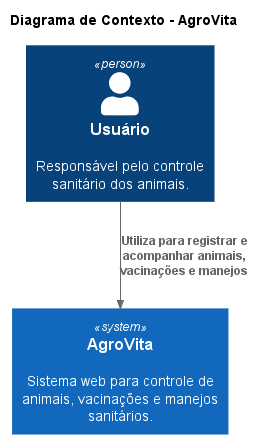
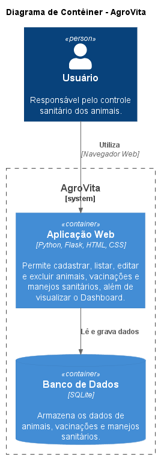
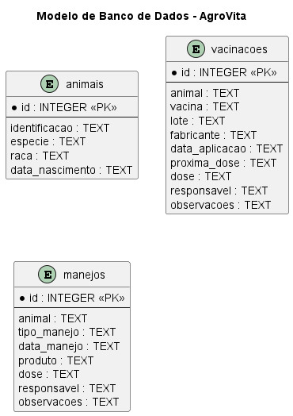
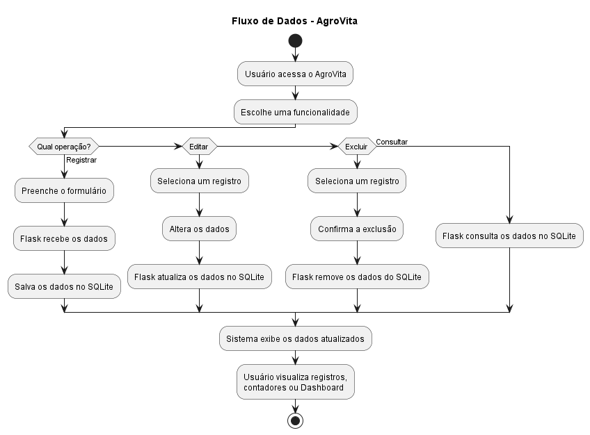

# AgroVita — Controle de Manejo Sanitário e Vacinação
🌐 **Aplicação online:** https://laisy2k.pythonanywhere.com/

Sistema web desenvolvido para auxiliar no controle sanitário de animais, permitindo organizar informações sobre animais, vacinações e manejos sanitários em um único ambiente.

## Sobre o projeto

O AgroVita foi desenvolvido com o objetivo de facilitar o registro e acompanhamento de informações relacionadas à saúde e ao manejo dos animais de uma propriedade rural.

O sistema permite manter os registros organizados, acompanhar vacinações e consultar informações por meio de um Dashboard.

## Funcionalidades

- Registro, edição, listagem e exclusão de animais
- Registro, edição, listagem e exclusão de vacinações
- Registro, edição, listagem e exclusão de manejos sanitários
- Acompanhamento do status das vacinações
- Identificação de vacinações atrasadas
- Dashboard com informações gerais do sistema
- Persistência dos dados utilizando SQLite

## Tecnologias utilizadas

- Python
- Flask
- SQLite
- HTML
- CSS
- JavaScript
- Chart.js
- PlantUML
- Git e GitHub

## Arquitetura

Os diagramas do sistema foram desenvolvidos utilizando PlantUML e estão disponíveis no repositório.

### Diagrama de Contexto — C4 Nível 1



### Diagrama de Contêiner — C4 Nível 2



### Modelo de Banco de Dados — DER



### Fluxo de Dados



## Estrutura do projeto

```text
├── app.py
├── templates/
├── static/
├── docs/
├── diagrama_contexto.puml
├── diagrama_container.puml
├── modelo_banco_dados.puml
├── fluxograma_processo.puml
├── requirements.txt
└── README.md
```

## Como executar o projeto

1. Clone o repositório:

```bash
git clone https://github.com/laisy2k/controle-de-manejo-sanitario-e-vacinacao.git
```

2. Acesse a pasta do projeto:

```bash
cd controle-de-manejo-sanitario-e-vacinacao
```

3. Instale as dependências:

```bash
pip install -r requirements.txt
```

4. Execute a aplicação:

```bash
python app.py
```

5. Acesse no navegador:

```text
http://127.0.0.1:5000
```

O banco de dados SQLite é criado automaticamente ao iniciar a aplicação.

## Desenvolvimento

O desenvolvimento foi organizado utilizando Issues, branches, Pull Requests e um quadro Kanban no GitHub Projects.

## Links

- Repositório: https://github.com/laisy2k/controle-de-manejo-sanitario-e-vacinacao
- GitHub Projects: https://github.com/laisy2k/controle-de-manejo-sanitario-e-vacinacao/projects

## Desenvolvedora

**Kezia Laís** — Desenvolvimento do projeto AgroVita.